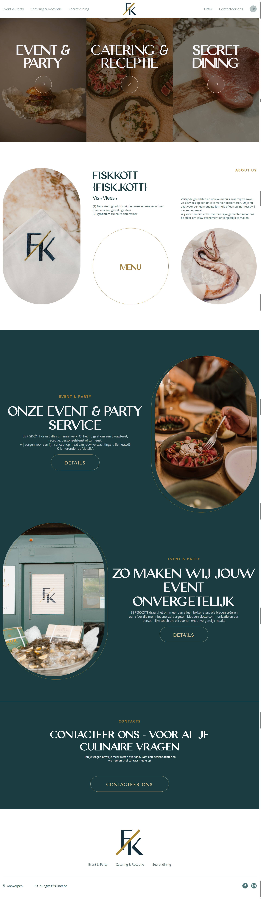

# 🍽️ FISKKÖTT — Gourmet Catering & Event Services

  
  
  

The website for **FISKKÖTT**, a catering and event service offering gourmet menus, custom event concepts, and curated dining experiences.  
The project features **smooth CSS animations** to enhance visual storytelling and create an elegant, engaging experience.  

---

## 🌐 Demo

[View live demo](https://developer-online.com/portfolio/fk/)

---

## 🛠 Tech Stack

- **HTML5 / CSS3 / JavaScript** — custom layout, styling, and interactivity  
- **CSS Animations** — subtle effects and smooth transitions  
- Responsive & mobile-friendly design  
- Visuals and image-rich presentation  

---

## ✨ Features

- Showcase of services: Event & Party, Catering & Receptie, Secret Dining  
- Smooth CSS animations for a dynamic feel  
- About section with concept and philosophy  
- Contact form / contact section  
- Elegant, image-driven design and layout  

---

## 📸 Screenshots  

  

---
